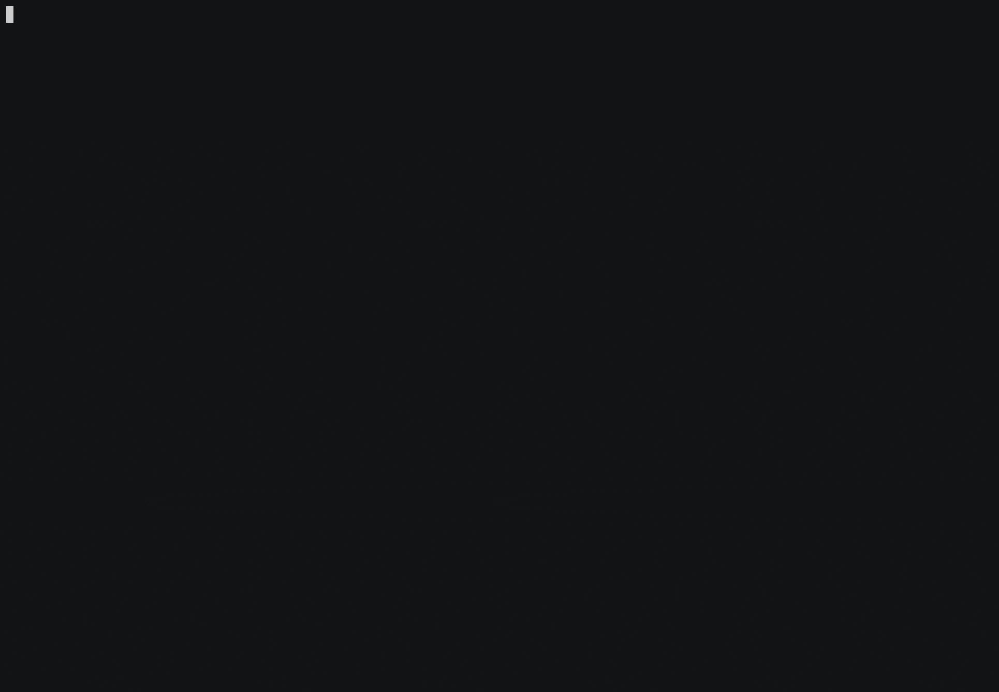

# ls-key

This is an experimental cli file navigator. If you use `ls` regularly for simply poking around your files, you may appreciate `ls-key`. Each file and dir has a numbered key. Type the number + enter and voila! At the momement, only files and dirs are differentiated by hard-coded colors, so you can't see if a file is executable or something.


## Dependencies

You'll need xdo-tool installed to use `w` and `r` commands.

Also set your default editor, such as

`export EDITOR="vim"`

otherwise it will default to nano editor.

## Usage

For the equivalent of `ls -a`, do `lsk -a`.

Hit enter when you want to execute.

**fuzzy-widdle:** `f ` (remember the space and then type)

**Go back:** `0`

**Quite:** `q`

**Work in viewed dir:** `w`

**Select range of files:** `<key_start>-<key_end>` (e.g. 7-5)

**Return file/dir paths:** `r <key1> <key2> [...]`

**Next-page:** `<key>-` (e.g. For example `49-` if there are more than 49 files.

**Show first file onwards:** `0-`

## Goals

* Easy installation for non-rust users.

* Test on MacOS and maybe see about Windows compatibility.

* Add more file colors (only file and dir differentiated right now).

* LS_COLOR support and don't rely on hard-coding color scheme.

* Add async and do more pass-by-reference: it's slow if there are a ton of files in the top of directory.

* Edit a command without having to rely solely on backspace.

* Cursor (blinky thing that moves when you type) should be visible.

* Escape a file view from widdling-down or selecting a range.

* Maybe figure out an alternative to xdo-tool (using env var to return file names is sorta hacky).

* Use more screen real-estate and handle file name wraps.

## Other usage

If you like tools like `fzf`, you may like this. You can run ls-key with scripts you make (bash, python, etc) for fuzzy directory jumping, fuzzy file opening, and fuzzy commands (very experimental).

`c` is for command.



####  Fuzzy dir

`lsk --fuzzy-dir /path/to/fuzzy/dir/script`

Here's my script I use personally.

```
#!/bin/bash

find -type d | cut -c 3- | fzf
```

#### Fuzzy file open

`lsk --fuzzy-find /path/to/fuzzy/file/open/script`

The script I use.

```
#!/bin/bash

fzf
```

You can pass all these args together and alias it to `lsk` for your convenience.

`lsk --fuzzy-dir /path/to/fuzzy/dir/script --fuzzy-find /path/to/fuzzy/file/open/script`

## Development

### Testing

At the moment, some tests must be ran on host while others in docker. ls-key's tests simulates keyboard input and I can't figure out how to do that in docker.

**Run tests for host or docker**

Stage code changes, if any. It's very important that you do this.

`git add -u`

Run the following scripts, which uncomment #[ignore] for either host or docker tests.

`./unignore_host_tests` or `./unignore_host_tests`

Run tests on host.

`cargo test -- --test-threads=1 --nocapture`
Run tests on docker, using dev script.

`./dev.sh test rust-lib`

***Undo any unstaged changes (those are the 'unignore' script)***

`git restore .`

#### Special cases

For an unknown reason, these test only run if 'asked' to explicitly.

`./dev.sh test rust-lib list`

One or more tests rely on exact terminal size.

`./unignore_host_term_size_dependent`
